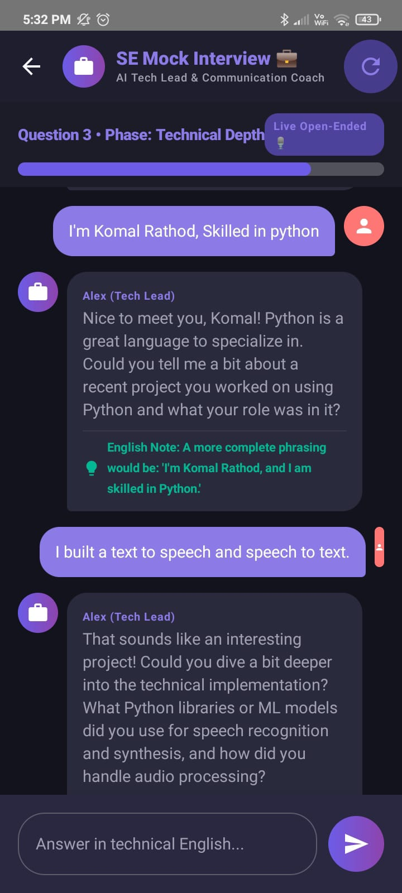

# 💬 EnglishPal — AI-Powered English & Interview Prep App

[](https://kotlinlang.org/)
[](https://developer.android.com/jetpack/compose)
[](https://developer.android.com/topic/architecture)
[](https://aistudio.google.com/)
[-FFCA28?style=flat-square&logo=firebase)](https://firebase.google.com/)

A modern, native Android application designed to help engineering students and job seekers master English fluency, grammar accuracy, and technical interview communication through interactive **Google Gemini AI** conversations.

---

## 💡 Why I Built This

As a final-year Information Technology student preparing for placement season, I noticed many talented peers struggle not with coding, but with **articulating technical ideas clearly in English during interviews**. 

Existing apps were either passive grammar quizzes or generic language tools without context. I engineered **EnglishPal** to simulate realistic software engineering technical interviews with an AI interviewer ("Alex"), offering **instant dual-aspect feedback** (technical correctness + English grammar precision).

---

## ✨ Core Features

- 🎙️ **AI Software Engineering Mock Interviewer**: Multi-stage mock technical interviews covering **Introduction**, **Technical Depth**, **Behavioral (STAR method)**, and **Wrap-up** with detailed end-of-session evaluation report cards.
- 💬 **Interactive AI Conversation Partner**: Natural chat mode powered by Gemini AI with inline sentence restructuring, tense corrections, and context suggestions.
- 📝 **Adaptive Grammar Quizzes**: Topic-specific quizzes (Tenses, Prepositions, Active/Passive, Conditionals) with Gemini-driven error analysis and explanation breakdowns.
- 📚 **Personalized Grammar Vault**: Auto-captures mistakes from chats and quizzes into a personal Firestore-backed mistake log for spaced repetition.
- 🔥 **Gamified Streak & Analytics**: Real-time streak tracking to build consistent daily practice habits.
- 🔐 **Firebase Auth**: Secure Google, Email/Password, and Guest login modes.

---

## 📱 Screen Highlights

| Home Dashboard | AI Conversation | AI Mock Interview |
|:---:|:---:|:---:|
|  |  |  |

| Grammar Quiz | Detailed Feedback | Mistakes Vault |
|:---:|:---:|:---:|
|  |  |  |

---

## 🏗️ Architecture & Tech Stack

The app is built adhering strictly to **Android Clean Architecture** guidelines and **MVVM** design principles for modularity, testability, and clean separation of concerns.

```
app/src/main/java/com/englishpal/app/
├── data/           # Remote & local data sources, Firestore & Gemini repositories
├── di/             # Dagger Hilt Dependency Injection modules
├── domain/         # Pure Kotlin models, repository interfaces & use cases
└── presentation/   # Jetpack Compose UI screens, Navigation, and ViewModels
```

### Tech Stack Matrix

| Component | Technology / Library |
| --- | --- |
| **Language** | Kotlin (v1.9.23) |
| **UI Framework** | Jetpack Compose + Material 3 Design System |
| **Architecture** | Clean Architecture + MVVM Pattern |
| **Dependency Injection** | Dagger Hilt (v2.51.1) |
| **Asynchronous & Streams** | Kotlin Coroutines, `StateFlow`, `callbackFlow` |
| **AI Engine** | Google Generative AI Client SDK (`Gemini 1.5`) |
| **Backend & Auth** | Firebase Authentication & Cloud Firestore |
| **Build Tools** | Gradle (Kotlin DSL - `build.gradle.kts`) |

---

## 🛠️ Key Engineering Highlights

- 🔒 **Zero-Trust API Key Security**: Secrets (`GEMINI_API_KEY`) are kept out of version control, injected at build time via `local.properties` into Gradle `BuildConfig`.
- ⚡ **Reactive Real-time Data**: Converted Cloud Firestore snapshot listeners into reactive Kotlin `Flow` streams using `callbackFlow`.
- 🎯 **Structured Prompt Engineering**: Utilized system instructions with JSON format constraints to enforce deterministic responses for error parsing.
- 🧱 **SOLID & Testable Codebase**: Pure Kotlin `domain` layer with zero framework dependencies for unit testability.

---

## 🚀 Quick Setup & Build Guide

### Prerequisites
- **Android Studio** (Hedgehog or newer)
- **JDK 17** & **Android SDK 34** (Min SDK: 26)
- Free **Gemini API Key** ([Google AI Studio](https://aistudio.google.com/))
- Firebase Project (`google-services.json`)

### Installation Steps

1. **Clone the repository**:
   ```bash
   git clone https://github.com/itsKomal1508/EnglishPal.git
   cd EnglishPal
   ```

2. **Add Gemini API Key**:
   Create a `local.properties` file in the root directory:
   ```properties
   GEMINI_API_KEY=your_actual_gemini_api_key_here
   ```

3. **Add Firebase Config**:
   Place your `google-services.json` inside the `app/` folder:
   ```
   EnglishPal/app/google-services.json
   ```

4. **Build & Run**:
   Open in Android Studio, sync Gradle, and run on device/emulator (API 26+).

---

## 👤 Author

**Komal Rathod**  
Final-Year B.Tech Student in Information Technology | Android Developer  

- 🔗 **LinkedIn**: [linkedin.com/in/komal-achut-rathod](https://www.linkedin.com/in/komal-achut-rathod)
- 🐙 **GitHub**: [github.com/itsKomal1508](https://github.com/itsKomal1508)
- 💻 **LeetCode**: [leetcode.com/u/Komal_rathod15](https://leetcode.com/u/Komal_rathod15/)
