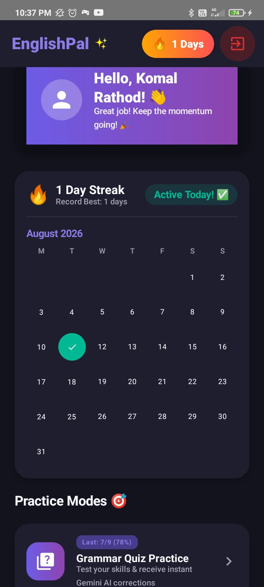
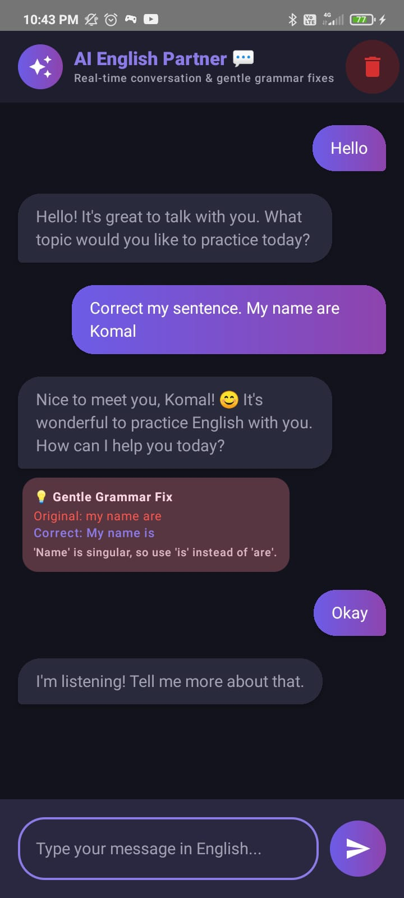
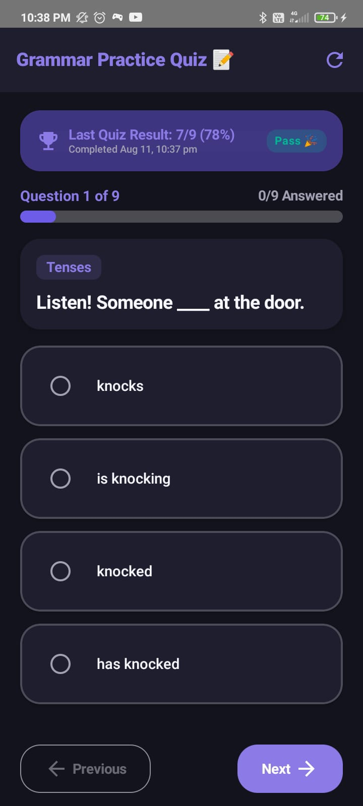
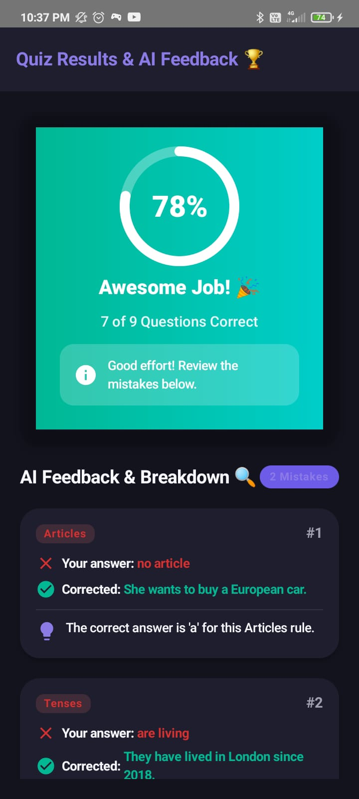
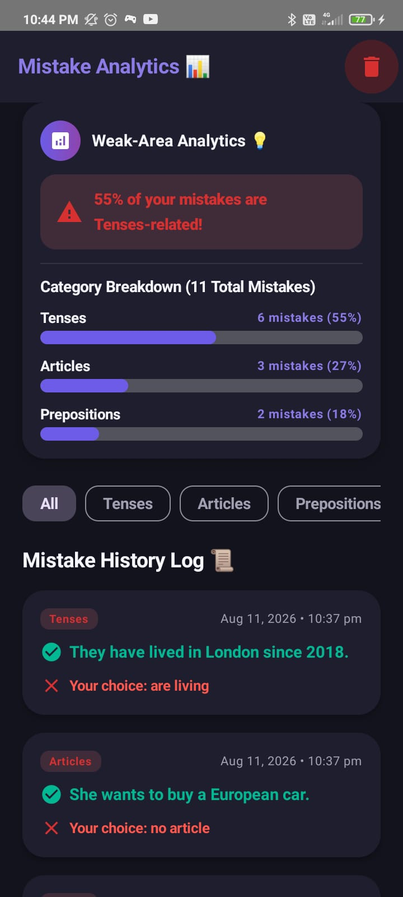

# EnglishPal 💬🤖

An AI-powered English learning assistant and software engineering mock interviewer built for Android using **Kotlin**, **Jetpack Compose**, **Google Gemini AI**, and **Firebase**.

EnglishPal helps students and job seekers improve their English communication, master grammar, and practice software engineering technical interviews through interactive AI conversations and dynamic evaluations.

---

## 🎯 Problem & Solution

* **Problem**: Many students and early-career software developers experience difficulty with English fluency, grammar accuracy, and technical communication during placement interviews. Practicing with peers can be difficult to schedule, while traditional grammar apps lack contextual, conversational feedback.
* **Solution**: **EnglishPal** brings together an interactive AI conversation partner, a staged mock technical interviewer, dynamic grammar quizzes with AI evaluations, and a real-time grammar mistake vault—all inside a modern, native Android app.

---

## ✨ Key Features

* 💬 **AI English Conversation Partner**: Practice freeform English conversations. Powered by Gemini AI, the app provides real-time inline grammar and vocabulary corrections for user messages.
* 🎙️ **Software Engineering Mock Interviewer**: Simulates a multi-stage technical job interview led by an AI Tech Lead (Alex). Covers **Introduction**, **Technical**, **Behavioral**, and **Wrap-up** stages with dual feedback per response (technical depth + English grammar precision) and an end-of-session evaluation report card.
* 📝 **Adaptive Grammar Quizzes**: Topic-wise grammar quizzes (Tenses, Prepositions, Subject-Verb Agreement, Articles, Conditionals, Modals, Passive Voice, Direct/Indirect Speech). Submissions are evaluated by Gemini AI to deliver personalized feedback, answer explanations, and weak area insights.
* 📚 **Personalized Grammar Mistakes Vault**: Automatically captures grammatical errors from conversation chats and quiz sessions, storing original vs. corrected sentences with explanations for structured review.
* 🔥 **Daily Practice Streak**: Gamified daily tracking system that encourages consistent learning habits by logging daily user engagement.
* 🔐 **Firebase Authentication**: Secure user login supporting Google Sign-In, Email/Password, and Guest access modes.

---

## 🏗️ Technical Architecture & Design Patterns

The app is built following **Android Clean Architecture** guidelines and the **MVVM (Model-View-ViewModel)** architectural pattern for clear separation of concerns, testability, and maintainability.

```
app/src/main/java/com/englishpal/app/
├── data/
│   ├── datasource/          # Dynamic question banks & static data sources
│   └── repository/          # Data repositories (Firestore & Gemini API integration)
├── di/                      # Hilt Dependency Injection modules (Firebase, Gemini, Repositories)
├── domain/
│   ├── model/               # Domain data models (ChatMessage, InterviewMessage, Quiz, etc.)
│   ├── repository/          # Abstract repository interfaces
│   └── usecase/             # Domain business logic & use cases
├── presentation/
│   ├── auth/                # Authentication screens & AuthViewModel
│   ├── conversation/        # AI Chat partner UI & ConversationViewModel
│   ├── home/                # Dashboard UI, streak tracking & HomeViewModel
│   ├── interview/           # Mock Interview UI & InterviewViewModel
│   ├── mistakes/            # Grammar Mistakes Vault UI & MistakesViewModel
│   ├── navigation/          # Jetpack Compose NavHost navigation graph
│   ├── quiz/                # Quiz & QuizFeedback screens & QuizViewModel
│   └── theme/               # Material 3 color palettes, typography, and styling
└── MainActivity.kt          # Main activity & entry point
```

### 💡 Key Engineering Highlights
* **Clean Architecture & Separation of Concerns**: Strict decoupling across Presentation, Domain, and Data layers.
* **Direct Gemini AI Integration**: Utilizes the official Google AI Client SDK (`com.google.ai.client.generativeai`) with custom structured JSON prompt engineering for deterministic evaluation parsing.
* **Reactive Real-time Streams**: Employs **Kotlin Coroutines** and `callbackFlow` to adapt Cloud Firestore snapshot listeners into reactive `Flow` data streams.
* **Dependency Injection**: Fully configured using **Dagger Hilt** with scoped singletons and ViewModel bindings.
* **Secure API Key Management**: API secrets are configured outside version control using Gradle `local.properties` build-time `BuildConfig` field injection.

---

## 🛠️ Tech Stack

* **Language**: [Kotlin](https://kotlinlang.org/) (v1.9.23)
* **UI Framework**: [Jetpack Compose](https://developer.android.com/jetpack/compose) with Material 3 Design System
* **Architecture**: Clean Architecture + MVVM
* **Dependency Injection**: [Dagger Hilt](https://dagger.dev/hilt/) (v2.51.1)
* **Async & Reactive**: Kotlin Coroutines & `Flow` (`StateFlow`, `SharedFlow`, `callbackFlow`)
* **AI Engine**: Google AI Client SDK (`generativeai` v0.9.0 - Gemini Pro)
* **Backend Services**: Firebase Authentication & Cloud Firestore
* **Navigation**: Jetpack Navigation Compose
* **Build System**: Gradle (Kotlin DSL - `build.gradle.kts`)

---

## 🔑 Secret Configuration & Setup Guide

### Prerequisites
* **Android Studio** (Hedgehog 2023.1.1 or newer recommended)
* **JDK 17**
* **Android SDK 34** (minimum supported SDK: 26 / Android 8.0)
* A valid **Google Gemini API Key** (from [Google AI Studio](https://aistudio.google.com/))
* A **Firebase Project** with Authentication and Firestore enabled

### Setup Instructions

1. **Clone the repository**:
   ```bash
   git clone https://github.com/itsKomal1508/EnglishPal.git
   cd EnglishPal
   ```

2. **Configure API Secrets (`local.properties`)**:
   Create or open `local.properties` in the root project directory and add your Gemini API key:
   ```properties
   GEMINI_API_KEY=your_gemini_api_key_here
   ```
   > 🔒 *Note: `local.properties` is listed in `.gitignore` to prevent API keys from being committed to Git.*

3. **Add Firebase Configuration**:
   * Create a project in [Firebase Console](https://console.firebase.google.com/).
   * Register your Android app package (`com.englishpal.app`).
   * Download `google-services.json` and place it inside the `app/` directory:
     ```
     EnglishPal/
     └── app/
         └── google-services.json
     ```

4. **Build and Run**:
   * Open the project in Android Studio.
   * Sync Gradle files (`File -> Sync Project with Gradle Files`).
   * Select an emulator or physical device (Android 8.0 / API 26+) and click **Run**.

---

## 📱 Screenshots

|             Home Dashboard             |                AI Conversation Partner                 |                  AI Mock Interview                  |
|:--------------------------------------:|:------------------------------------------------------:|:---------------------------------------------------:|
| ** | ** | ** |

|              Grammar Quiz               |                  Quiz Feedback                  |                 Mistakes Vault                 |
|:---------------------------------------:|:-----------------------------------------------:|:----------------------------------------------:|
| ** | *)* | ** |

---

## 🚀 Future Enhancements

* **Voice Input & Pronunciation (STT/TTS)**: Integrating Speech-to-Text and Text-to-Speech to enable real-time spoken audio practice and pronunciation scoring.
* **Offline Quiz Mode**: Room database caching for offline practice access when network connectivity is unavailable.
* **Progress Analytics Dashboard**: Detailed charts tracking grammar accuracy and vocabulary growth over time.

---

## 👤 Author

**Komal**  
Final-Year B.Tech Student | Software & Android Developer

* **GitHub**: [@itsKomal1508](https://github.com/itsKomal1508)
* **LinkedIn**: [Connect on LinkedIn](https://www.linkedin.com/in/komal-achut-rathod/)
